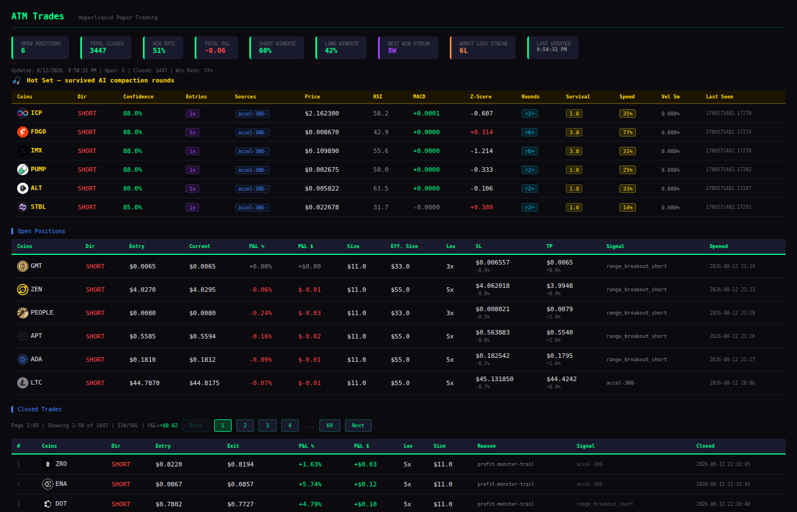
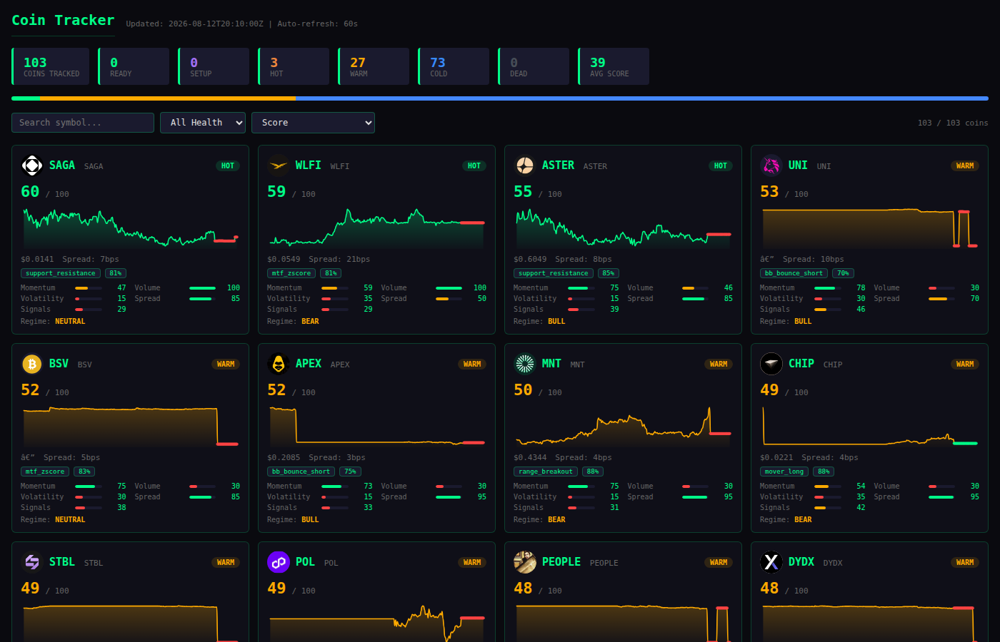

# ATM — AI Trading Machine

> **Hyperliquid momentum-based algorithmic trading system**
> 544 tokens monitored · 55+ signal types · Paper & live modes · Kill switch safety

---

## Live Dashboard

[](docs/trades_dashboard.png)

---

## System Overview

ATM is an event-driven trading system that continuously monitors cryptocurrency markets, identifies momentum-based trading opportunities using technical indicators (RSI, MACD, z-score velocity, percentile rank), and executes trades on Hyperliquid exchange.

## Tech Stack

| Layer | Tech |
|-------|------|
| Language | Python 3 (~280 scripts, zero frameworks) |
| Local DB | SQLite (WAL mode) — prices, candles, signals |
| Remote DB | PostgreSQL (psycopg2) — trade history, analytics |
| Scheduler | systemd timers (59 timers, no cron) |
| Web server | nginx (serves static JSON dashboard data) |
| Dashboard | Streamlit (port 8501, local ML dashboard) |
| Exchange SDK | `hyperliquid-python-sdk` + `eth_account` |
| Market data | Binance REST API → stored in local SQLite |
| HTTP | `requests` + `urllib.request` (stdlib) |
| Math/ML | `numpy`, `pandas` |
| Config | `hermes_constants.py` (single source of truth) |
| Secrets | `.secrets.local` (gitignored) |
| Locking | `fcntl.flock` (file-level) |
| LLM | `mimo-v2.5` (context gate only, not core trading) |

<details>
<summary><b>Design Choices</b></summary>

- **Local-first data** — all price reads route to local SQLite; external APIs write into local DB
- **Deterministic over LLM** — `signal_compactor.py` replaces LLM for trade decisions
- **File-based state** — JSON files for hotset, signals, regime data; atomic writes via `fcntl.flock`
- **Zero web frameworks** — pure scripts + SQLite + systemd + nginx
- **Two-database split** — SQLite for fast local reads, PostgreSQL for persistent trade history

</details>

### Top Signals

| Signal | Type | Description |
|--------|------|-------------|
| `bb_bounce` | Bollinger Band | Bounce off lower/upper band |
| `macd_accel` | Momentum | 1m MACD acceleration per-token |
| `hzscore` | Statistical | Multi-TF z-score velocity |
| `hh_hl` | Structure | Higher High / Higher Low + CHoCH |
| `ema9_sma20` | Moving Average | EMA9/SMA20 crossover |
| `continuation` | Trend | Trend continuation after pullback |
| `engulfing` | Candlestick | Bullish/bearish engulfing |
| `ma_100_bounce` | Support/Resistance | MA100 bounce |
| `gap_300` | Volatility | 300%+ volume gap |
| `fast_momentum` | Speed | High-speed momentum burst |

**Plus 49 more** — 59 total. All signals are **plug-and-play**: drop a script in `scripts/signals/`, register it, and it's live.

<details>
<summary><b>How to Make a Signal</b></summary>

See the **[add-signal](skills/add-signal/)** skill — complete checklist:

1. Create script in `scripts/signals/`
2. Add flags to `hermes_constants.py`
3. Register in `signals/__init__.py`
4. Add Layer 2 enforcement in `signal_schema.py`
5. Run `bug_hunter` → commit → done

</details>

---

## Full Pipeline

```mermaid
flowchart LR
    classDef data fill:#1f6feb,stroke:#58a6ff,color:#fff
    classDef db fill:#a371f7,stroke:#d2a8ff,color:#fff
    classDef proc fill:#21262d,stroke:#8b949e,color:#c9d1d9
    classDef gate fill:#da3633,stroke:#f85149,color:#fff,stroke-width:2px
    classDef exit fill:#238636,stroke:#3fb950,color:#fff
    classDef skip fill:#30363d,stroke:#484f58,color:#8b949e
    classDef signal fill:#1c2333,stroke:#58a6ff,color:#79c0ff
    classDef layer fill:#1c1c2e,stroke:#8b949e,color:#c9d1d9

    subgraph INGEST["  INGEST  "]
        direction TB
        HL["<b>HL allMids</b><br/>542 token prices"]:::data
        CACHE["<b>hype_cache</b><br/>hl_cache.json"]:::proc
        DB1[(<b>candles.db</b><br/>1m 5m 15m 1h 4h)]:::db
        HL --> CACHE --> DB1
    end

    subgraph SIGNALS["  SIGNALS  "]
        direction TB
        SIG["<b>signals_runner</b><br/>55+ scripts"]:::proc
        S1["<b>macd_accel</b><br/>per-token 1m MACD"]:::signal
        S2["<b>hh_hl_choch</b><br/>HH/HL + Change of Character"]:::signal
        S3["<b>hzscore</b><br/>multi-TF z-score"]:::signal
        S4["<b>bb_bounce</b><br/>Bollinger Band"]:::signal
        S5["<b>momentum</b><br/>pct-hermes + accel"]:::signal
        SIGDB[(<b>signals DB</b><br/>decision=PENDING)]:::db
        SIG --> S1
        S1 --> S2 --> S3 --> S4 --> S5 --> SIGDB
    end

    subgraph FILTER["  FILTER  "]
        direction TB
        COMPACT["<b>signal_compactor</b><br/>expire · group · blacklist<br/>score · rank top 10"]:::proc
        ANALYST["<b>signal_analyst</b><br/>trend 0-30 · RSI 0-20<br/>WR 0-25 · time 0-10<br/>blacklist 0-15 · pass ≥60"]:::proc
        HS[(<b>hotset.json</b><br/>top 10 APPROVED)]:::db
        COMPACT --> ANALYST --> HS
    end

    subgraph DECIDE["  DECIDE  "]
        direction TB
        DECIDER["<b>decider_run</b><br/>eligibility · inversion<br/>z-score freshness"]:::proc
        L1["<b>L1 Rule-based</b><br/>speed · momentum · RSI"]:::layer
        L2["<b>L2 Similar setup</b><br/>hist WR <30% = SKIP"]:::layer
        L3["<b>L3 Token sentiment</b><br/>≤ -0.7 = SKIP"]:::layer
        L4["<b>L4 Hebbian gate</b><br/>score ≥0.65 = approve"]:::layer
        L5["<b>L5 LLM gate</b><br/>MiniMax-M3"]:::layer
        GATE{"<b>GO?</b>"}:::gate
        BRAIN["<b>brain.py</b><br/>atomic claim · HL API"]:::exit
        SKIP["SKIP"]:::skip
        DECIDER --> L1 --> L2 --> L3 --> L4 --> L5 --> GATE
        GATE -->|"PASS"| BRAIN
        GATE -->|"NAY"| SKIP
    end

    subgraph EXIT["  EXIT  "]
        direction TB
        PM["<b>position_manager</b><br/>ATR SL/TP + trailing"]:::proc
        PMDETAIL["ATR(14) tiers<br/>LOW=0.8 · NORMAL=1.0 · HIGH=0.25<br/>Trailing: +0.30% act, 0.30% trail<br/>Stale: winner ≥60m / loser ≥8m"]:::layer
        PROFIT["<b>profit_monster</b><br/>T1: 0.5-2% max 2/wake<br/>T2: 2-5% max 1/wake<br/>Trail: +0.40% act, 0.25%"]:::exit
        CUT["<b>cut_loser</b><br/>T1: -0.75% quick cut<br/>T2: -3% deep cut<br/>Trailing loss recovery"]:::exit
        GUARD["<b>guardian</b><br/>orphan detect · HL sync<br/>loss cooldowns"]:::proc
        CLOSE["<b>CLOSE</b><br/>HL market order"]:::exit
        PM --> PMDETAIL --> PROFIT --> CUT --> GUARD --> CLOSE
    end

    DB1 --> SIG
    SIGDB --> COMPACT
    HS --> DECIDER
    BRAIN --> PM
    BRAIN -.-> PROFIT
    BRAIN -.-> CUT
    BRAIN -.-> GUARD

    style INGEST fill:#0d1117,stroke:#1f6feb,stroke-width:2px,color:#58a6ff
    style SIGNALS fill:#0d1117,stroke:#a371f7,stroke-width:2px,color:#d2a8ff
    style FILTER fill:#0d1117,stroke:#8b949e,stroke-width:2px,color:#8b949e
    style DECIDE fill:#0d1117,stroke:#da3633,stroke-width:2px,color:#f85149
    style EXIT fill:#0d1117,stroke:#238636,stroke-width:2px,color:#3fb950
```



<details>
<summary><b>Architecture at a Glance</b></summary>

| Phase | Script | What it does | Frequency |
|-------|--------|--------------|-----------|
| **0. Data** | `price_collector.py` | Fetch 542 token prices from HL API | 1 min |
| **1. Signals** | `signals_runner.py` | Run 55+ signal scripts | 1 min |
| **2. Compact** | `signal_compactor.py` | Score, rank, dedupe → top 10 | 1 min |
| **2.5. Analyst** | `signal_analyst.py` | Quality score 0-100 | 1 min |
| **3. Decide** | `decider_run.py` | Context Gate (5 layers) → execute | 1 min |
| **4. Manage** | `position_manager.py` | ATR SL/TP, trailing stops | 1 min |
| **5. Profit** | `profit_monster.py` | Tier 1 (scalp) + Tier 2 (runner) | 1-10 min |
| **6. Cut** | `cut_loser.py` | Quick cut + deep cut | frequent |
| **7. Guardian** | `hl-sync-guardian.py` | Kill switch, HL reconciliation | 60s |

</details>

<details>
<summary><b>Context Gate (5 Layers)</b></summary>

```
Layer 1: RULE-BASED GATE
  ├─ Speed < 20% = AMBIGUOUS
  ├─ Global filters: speed, momentum, RSI, z-score
  ├─ Strong setup (speed≥70% + z confirms) = GO (skip LLM)
  └─ Counter-trend trap detection

Layer 2: SIMILAR SETUP LOOKUP
  └─ PostgreSQL: past trades with same conditions
     WR < 30% with n>=5 = SKIP

Layer 3: TOKEN SENTIMENT
  └─ sentiment <= -0.7 = SKIP

Layer 4: HEBBIAN GATE
  ├─ Auto-approve: score >= 0.65 (WR>=60%, n>=3)
  └─ Auto-reject: score <= 0.35 (WR<=30%, n>=5)

Layer 5: LLM CONTEXT GATE (MiniMax-M3)
  └─ GO / WARN (penalty) / NAY (block)
```

</details>

<details>
<summary><b>Kill Switch</b></summary>

| Mode | Behavior |
|------|----------|
| `live_trading: false` | All trades stay in paper DB (simulation only) |
| `live_trading: true` | Guardian mirrors approved trades to real HL orders |

**Guardian reconciliation** (every 60s): reads kill switch → mirrors paper positions to HL → reconciles HL ↔ paper DB → marks orphan closes.

</details>

---

## Tuning Parameters (`hermes_constants.py`)

All system constants live in `scripts/hermes_constants.py`. Edit to tune.

<details>
<summary><b>Position Limits</b></summary>

| Constant | Default | Controls |
|----------|---------|----------|
| `MAX_OPEN_POSITIONS` | 6 | Max concurrent trades |
| `MAX_HYPE_POSITIONS` | 5 | Max in top-hype tokens |
| `MAX_TOTAL_POSITIONS` | 10 | Max including pending |
| `DEFAULT_TRADE_SIZE_USDT` | $11 | Default trade size |

</details>

<details>
<summary><b>Trailing Stops & Exits</b></summary>

| Constant | Default | Controls |
|----------|---------|----------|
| `TRAILING_ACTIVATION_PCT` | 0.40% | When trailing activates |
| `TRAILING_DISTANCE_PCT` | 0.30% | Trail distance behind peak |
| `STALE_WINNER_TIMEOUT_MINUTES` | 60 | Close winners flat for 60+ min |
| `STALE_LOSER_TIMEOUT_MINUTES` | 8 | Cut losers flat for 8+ min |
| `STALE_WINNER_MIN_PROFIT` | 0.6% | Min profit to be "winner" |
| `ATR_SL_MIN` | 1.2% | Minimum stop loss |
| `ATR_TP_MIN` | 0.8% | Minimum take profit |

</details>

<details>
<summary><b>Signal Filtering</b></summary>

| Constant | Default | Controls |
|----------|---------|----------|
| `SPEED_BOOST_THRESHOLD` | 70 | pctl ≥70 → easier entry |
| `SPEED_HOTSET_THRESHOLD` | 80 | pctl ≥80 → hot-set boost |
| `SPEED_ABS_MIN_THRESHOLD` | 2.5% | Absolute speed floor per 5m |
| `VEL_STALE_THRESHOLD_PCT` | 0.05% | Below this = "flat" |
| `MOMENTUM_EXHAUSTION_THRESHOLD` | 0.5% | Price moved 0.5% in 30m = no enter |
| `SIGNAL_QUALITY_MIN_GRADE` | 'C' | Only trade C or better |

</details>

<details>
<summary><b>Blacklists</b></summary>

| Constant | Purpose |
|----------|---------|
| `LONG_BLACKLIST` | Tokens blocked for LONG |
| `SHORT_BLACKLIST` | Tokens blocked for SHORT |
| `SIGNAL_SOURCE_BLACKLIST` | Signal combos blocked (e.g. `return_exhaustion-`) |

</details>

<details>
<summary><b>Risk Management</b></summary>

| Constant | Default | Controls |
|----------|---------|----------|
| `KELLY_ENABLED` | False | Kelly criterion (until 50+ trades) |
| `KELLY_FRACTION` | 0.25 | Quarter-Kelly |
| `DRAWDOWN_ENABLED` | True | Drawdown circuit breaker |
| `PORTFOLIO_HEAT_ENABLED` | True | Portfolio heat tracking |
| `MAX_PORTFOLIO_HEAT` | 0.15 | Max 15% total risk |
| `CONSERVATIVE_MODE_ENABLED` | False | 0.5x size multiplier |

</details>

<details>
<summary><b>Signal Grades</b></summary>

| Grade | Weight | Meaning |
|-------|--------|---------|
| A | 1.5x | Strong edge |
| B | 1.2x | Good edge |
| C | 1.0x | Moderate edge |
| D | 0.8x | Weak edge |
| F | 0.5x | No edge |

</details>

---

## Automation Team

ATM runs a **CEO + automation team** that continuously improves the system.

<details>
<summary><b>The Team</b></summary>

| Role | Script | Job |
|------|--------|-----|
| **CEO** | `automation/ceo/ceo_prompt.md` | Strategic decisions, param changes |
| **Orchestrator** | `automation/orchestrator_prompt.md` | Daily implementation pipeline (12h) |
| **Health Monitor** | `automation/health_monitor_prompt.md` | Pipeline health + anomalies (hourly) |
| **Signal Reporter** | `automation/signal_reporter_prompt.md` | Signal performance analysis (6h) |
| **Blacklist Tester** | `automation/blacklist_tester.py` | Test blacklisted tokens (12h) |
| **Self Learner** | CEO team member | Parameter tuning, signal tuning |
| **Bug Hunter** | `skills/bug-hunter/` | Find and fix bugs |
| **Summarizer** | `automation/summarizer_prompt.md` | All automation results (12h) |
| **Upgrade Implementer** | `automation/upgrade_implementer_prompt.md` | Scan plans, implement (12h) |

</details>

<details>
<summary><b>Automation Schedule</b></summary>

```
Hourly:     health_monitor, auto_1hr (trade analysis + tuning)
Every 6h:   signal_reporter
Every 12h:  blacklist_tester, summarizer, upgrade_implementer
Daily:      orchestrator (full pipeline audit)
```

</details>

<details>
<summary><b>CEO Workflow</b></summary>

1. **Verify numbers** — queries DB directly, never trusts old reports
2. **Find biggest problem** — worst signal, worst regime, worst close reason
3. **Fix it** — change param, disable signal, or delegate to team
4. **Log it** — kanban + report + OpenMemory

</details>

---

## Quick Start

### Prerequisites

```bash
# System deps
apt install python3-pip sqlite3

# Python deps
pip install requests sqlite3 openai

# OpenCode — AI-powered development assistant (required)
# Install: https://opencode.ai
# Recommended: opencode go + mimo v2.5 model
```

### Setup

```bash
# Clone the repo
git clone https://github.com/ghosteeeeeeee/ATM.git
cd ATM

# 1. Install deps
pip install -r requirements.txt

# 2. Init DBs (auto-loads backfill from seed/)
python3 scripts/signal_schema.py

# 3. Run the pipeline
python3 scripts/price_collector.py
python3 scripts/signal_gen.py
python3 scripts/ai_decider.py
python3 scripts/decider_run.py

# 4. Start the web dashboard
python3 scripts/hermes-trades-api.py  # Runs on :8080

# 5. View trades dashboard
# Open http://localhost:12345/trades.html in browser
# Or: http://localhost:8080/trades.html
```

### Dashboard Pages

| Page | URL | Description |
|------|-----|-------------|
| `trades.html` | `:12345/trades.html` | Main trading dashboard |
| `signals.html` | `:12345/signals.html` | Live signal feed |
| `coin_tracker.html` | `:12345/coin_tracker.html` | Per-coin intelligence |

### Coming Soon

[](docs/coin_tracker.png)

---

<details>
<summary><b>Data Stores</b></summary>

| Store | Contents |
|-------|----------|
| `signals_hermes.db` | price_history (~2.7M rows), latest_prices, regime_log |
| `signals_hermes_runtime.db` | signals table, token_speeds (544 tokens) |
| `state.db` | General state (messages, schema_version) |
| `predictions.db` | ML predictions |
| `hype_live_trading.json` | **KILL SWITCH** — live_trading flag |
| `hotset.json` | Current hot set (top 10 signals) |

</details>

<details>
<summary><b>Debugging</b></summary>

```bash
# Check price data
sqlite3 scripts/signals_hermes.db "SELECT token, COUNT(*) FROM price_history GROUP BY token LIMIT 5"

# Check runtime signals
sqlite3 scripts/signals_hermes_runtime.db "SELECT * FROM signals ORDER BY created_at DESC LIMIT 5"

# Check hotset
cat /var/www/hermes/data/hotset.json | python3 -m json.tool | head -50

# Check kill switch
cat /var/www/hermes/data/hype_live_trading.json

# Logs
tail -f /var/log/hermes/pipeline.log
tail -f /var/log/hermes/errors.log

# PostgreSQL (trade data)
sudo -u postgres psql -d brain -c "SELECT * FROM trades ORDER BY closed_at DESC LIMIT 10"
```

</details>

<details>
<summary><b>Configuration</b></summary>

- `config/` — tokens, thresholds, regime parameters
- `.env` — API keys (not committed)
- `cron/jobs.json` — cron schedule
- `hermes_constants.py` — all system constants (see Tuning Parameters above)

</details>

---

**Last updated:** 2026-08-12
