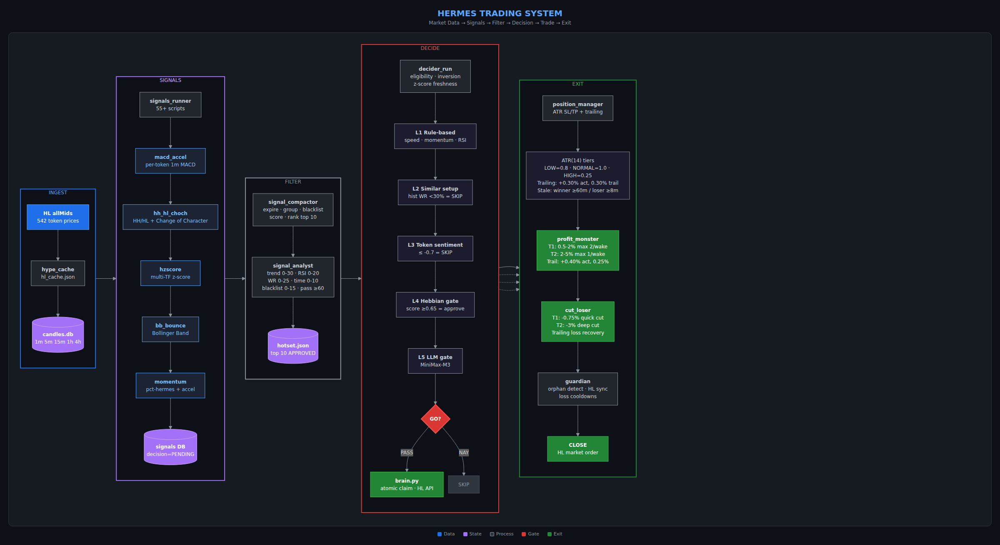
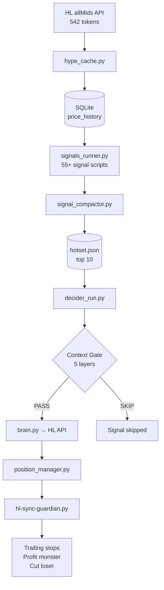

# Hermes Trading System

> **Hyperliquid momentum-based algorithmic trading system**
> 544 tokens monitored · 55+ signal types · Paper & live modes · Kill switch safety

[](docs/pipeline-diagram.png)

---

## Live Dashboard

[](docs/trades_dashboard.png)

[](docs/coin_tracker.png)

---

## System Overview

Hermes is an event-driven trading system that continuously monitors cryptocurrency markets, identifies momentum-based trading opportunities using technical indicators (RSI, MACD, z-score velocity, percentile rank), and executes trades on Hyperliquid exchange.

```
┌─────────────────────────────────────────────────────────────────┐
│                    HERMES TRADING SYSTEM                        │
├─────────────────────────────────────────────────────────────────┤
│  544 tokens  →  55+ signals  →  Context Gate  →  HL API        │
│                                                                 │
│  [price_collector] → [signal_gen] → [compactor] → [decider]   │
│       ↓                   ↓              ↓            ↓        │
│  price_history      signals DB     hotset.json    HL orders    │
└─────────────────────────────────────────────────────────────────┘
```

---

## Pipeline Flow



> **Full 7-phase diagram:** [docs/pipeline-diagram.md](docs/pipeline-diagram.md)

---

## Architecture at a Glance

| Phase | Script | What it does | Frequency |
|-------|--------|--------------|-----------|
| **0. Data** | `price_collector.py` | Fetch 542 token prices from HL API | 1 min |
| **1. Signals** | `signals_runner.py` | Run 55+ signal scripts (RSI, MACD, etc) | 1 min |
| **2. Compact** | `signal_compactor.py` | Score, rank, dedupe → top 10 | 1 min |
| **2.5. Analyst** | `signal_analyst.py` | Quality score 0-100 | 1 min |
| **3. Decide** | `decider_run.py` | Context Gate (5 layers) → execute | 1 min |
| **4. Manage** | `position_manager.py` | ATR SL/TP, trailing stops | 1 min |
| **5. Profit** | `profit_monster.py` | Tier 1 (scalp) + Tier 2 (runner) | 1-10 min |
| **6. Cut** | `cut_loser.py` | Quick cut + deep cut | frequent |
| **7. Guardian** | `hl-sync-guardian.py` | Kill switch, HL reconciliation | 60s |

---

## Context Gate (5 Layers)

The Context Gate is the brain of the system — a 5-layer funnel that decides which signals become trades:

```
Layer 1: RULE-BASED GATE
  ├─ Speed < 20% = AMBIGUOUS
  ├─ Global filters: speed, momentum, RSI, z-score
  ├─ Strong setup (speed≥70% + z confirms) = GO (skip LLM)
  └─ Counter-trend trap detection

Layer 2: SIMILAR SETUP LOOKUP
  └─ PostgreSQL: past trades with same conditions
     WR < 30% with n>=5 = SKIP

Layer 3: TOKEN SENTIMENT
  └─ sentiment <= -0.7 = SKIP

Layer 4: HEBBIAN GATE
  ├─ Auto-approve: score >= 0.65 (WR>=60%, n>=3)
  └─ Auto-reject: score <= 0.35 (WR<=30%, n>=5)

Layer 5: LLM CONTEXT GATE (MiniMax-M3)
  └─ GO / WARN (penalty) / NAY (block)
```

---

## Kill Switch

| Mode | Behavior |
|------|----------|
| `live_trading: false` | All trades stay in paper DB (simulation only) |
| `live_trading: true` | Guardian mirrors approved trades to real HL orders |

**Guardian reconciliation** (every 60s): reads kill switch → mirrors paper positions to HL → reconciles HL ↔ paper DB → marks orphan closes.

---

## Quick Start

```bash
cd /root/.hermes

# 1. Install deps
pip install requests sqlite3

# 2. Init DBs
python3 scripts/signal_schema.py

# 3. Run the pipeline
python3 scripts/price_collector.py
python3 scripts/signal_gen.py
python3 scripts/ai_decider.py
python3 scripts/decider_run.py

# 4. REST API for dashboard
python3 scripts/hermes-trades-api.py  # Runs on :8080
```

---

## Data Stores

| Store | Contents |
|-------|----------|
| `signals_hermes.db` | price_history (~2.7M rows), latest_prices, regime_log |
| `signals_hermes_runtime.db` | signals table, token_speeds (544 tokens) |
| `state.db` | General state (messages, schema_version) |
| `predictions.db` | ML predictions |
| `hype_live_trading.json` | **KILL SWITCH** — live_trading flag |
| `hotset.json` | Current hot set (top 10 signals) |

---

## Configuration

- `config/` — tokens, thresholds, regime parameters
- `.env` — API keys (not committed)
- `cron/jobs.json` — cron schedule

---

**Last updated:** 2026-08-12
