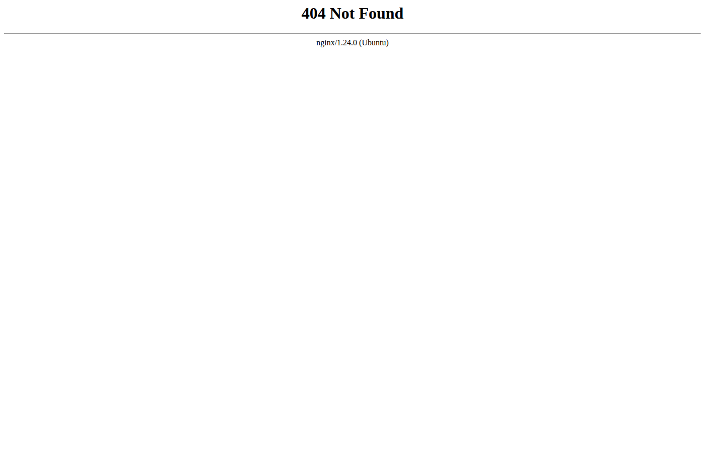
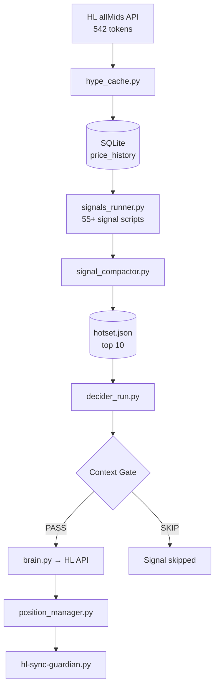

# Hermes Trading System

**Hyperliquid momentum-based algorithmic trading system** · Monitors 544 tokens · Generates scored signals · Executes leverage trades

[](docs/pipeline-diagram.png)

[](docs/trades_screenshot.png)

---

## System Overview

Hermes is an event-driven trading system that continuously monitors cryptocurrency markets, identifies momentum-based trading opportunities using technical indicators (RSI, MACD, z-score velocity, percentile rank), and executes trades on Hyperliquid exchange. The system supports both paper trading (simulated) and live trading, with a kill switch for safe切换.

---

## Pipeline Architecture



> Full detailed diagram: [docs/pipeline-diagram.md](docs/pipeline-diagram.md)

---

## Data Stores

| Store | Contents |
|-------|----------|
| `signals_hermes.db` | price_history (~2.7M rows), latest_prices, regime_log |
| `signals_hermes_runtime.db` | signals table, token_speeds (544 tokens) |
| `state.db` | General state (messages, schema_version) |
| `predictions.db` | ML predictions |
| `hype_live_trading.json` | **KILL SWITCH** — live_trading flag |
| `hotset.json` | Current hot set (top 10 signals) |

---

## Kill Switch

The system operates in two modes controlled by `hype_live_trading.json`:

| Mode | Behavior |
|------|----------|
| `live_trading: false` | All trades stay in paper DB (simulation only) |
| `live_trading: true` | hl-sync-guardian mirrors approved trades to real Hyperliquid orders |

**Guardian reconciliation** (every 60s): reads kill switch → mirrors paper positions to HL → reconciles HL ↔ paper DB → marks orphan closes.

---

## Pipeline Schedule

```
Every 1 min:  price_collector → signals → compactor → analyst → decider → position_manager
Every 10 min: strategy_optimizer, ab_optimizer, ab_learner
Separate:     profit_monster (1-10 min), cut_loser (frequent), guardian (60s)
```

---

## Quick Start

```bash
cd /root/.hermes

# 1. Install deps
pip install requests sqlite3

# 2. Init DBs (auto-loads backfill from seed/)
python3 scripts/signal_schema.py

# 3. Run the pipeline
python3 scripts/price_collector.py
python3 scripts/signal_gen.py
python3 scripts/ai_decider.py
python3 scripts/decider_run.py

# 4. REST API for dashboard
python3 scripts/hermes-trades-api.py  # Runs on :8080
```

---

## Configuration

- `config/` — tokens, thresholds, regime parameters
- `.env` — API keys (not committed)
- `cron/jobs.json` — cron schedule

---

**Last updated:** 2026-08-12
