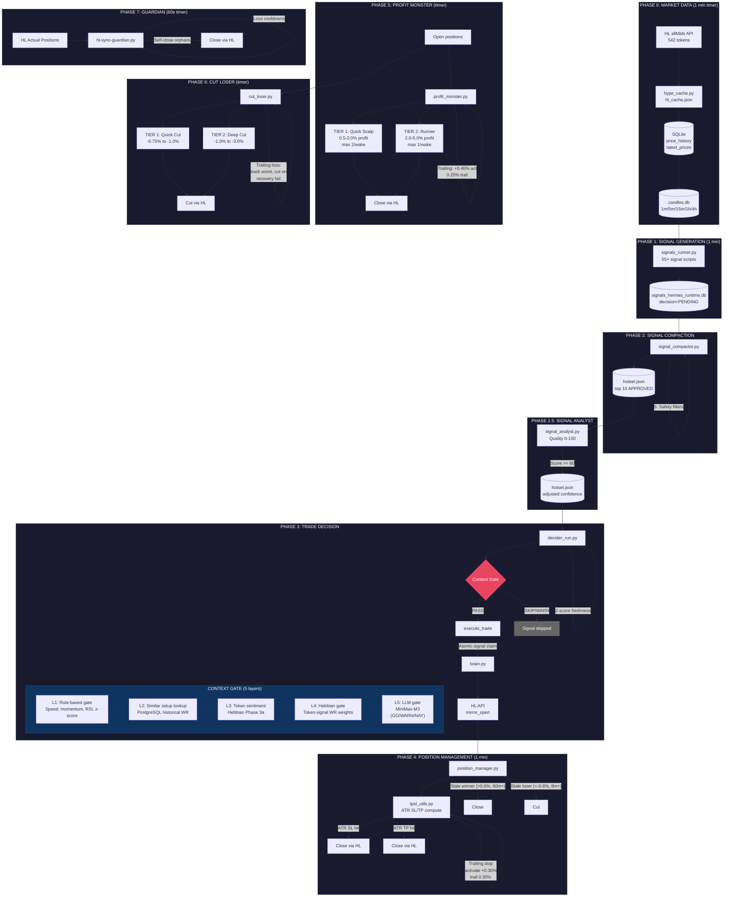

# Hermes Trading System — Full Pipeline Diagram

## Text Flow (Terminal-Friendly)

```
╔══════════════════════════════════════════════════════════════════════════════════════╗
║                        HERMES TRADING SYSTEM — FULL PIPELINE                       ║
╚══════════════════════════════════════════════════════════════════════════════════════╝

┌─────────────────────────────────────────────────────────────────────────────────────┐
│ PHASE 0: MARKET DATA INGESTION (every 1 min, standalone timer)                     │
│                                                                                     │
│   HL allMids API ──► hype_cache.py ──► SQLite ──► Binance Candles                  │
│   (542 tokens)       (hl_cache.json)    (price_history)  (1m/5m/15m/1h/4h)         │
│                                         (latest_prices)  candles.db                │
└──────────────────────────────┬──────────────────────────────────────────────────────┘
                               │
                               ▼
┌─────────────────────────────────────────────────────────────────────────────────────┐
│ PHASE 1: SIGNAL GENERATION (signals_runner.py, every 1 min)                        │
│                                                                                     │
│  55+ signal scripts in scripts/signals/                                             │
│  ┌──────────────┐ ┌──────────────┐ ┌──────────────┐ ┌──────────────┐              │
│  │ macd_accel   │ │ bb_bounce    │ │ hh_hl_choch  │ │ trend_purity │  ...etc       │
│  │ ma_100_cross │ │ hzscore      │ │ rs (S/R)     │ │ momentum     │              │
│  └──────┬───────┘ └──────┬───────┘ └──────┬───────┘ └──────┬───────┘              │
│         └────────────────┴────────────────┴────────────────┘                       │
│                               │                                                     │
│                               ▼                                                     │
│                    signals_hermes_runtime.db                                        │
│                    (decision = PENDING)                                             │
└──────────────────────────────┬──────────────────────────────────────────────────────┘
                               │
                               ▼
┌─────────────────────────────────────────────────────────────────────────────────────┐
│ PHASE 2: SIGNAL COMPACTION (signal_compactor.py)                                    │
│                                                                                     │
│  ┌─ Expire stale PENDING (>10 min) ─────────────────────────────────────────────┐  │
│  │                                                                               │  │
│  ├─ GROUP BY combo_key (token + direction + source-set) ────────────────────────┤  │
│  │                                                                               │  │
│  ├─ PRE-FILTER:                                                                  │  │
│  │   ├─ SHORT/LONG BLACKLIST check ──────────────── (hermes_constants.py)       │  │
│  │   ├─ Solana-only / delisted guard                                          │  │
│  │   ├─ Disabled-component guard                                              │  │
│  │   ├─ Directional conflict (same source + and -) ──── SKIP                  │  │
│  │   ├─ Co-signal gate (poison combos like accel-300+ + ma-cross-5m+)         │  │
│  │   └─ Confluence gate (need 2+ unique signal types) ──── (CONFLUENCE_REQUIRED)│  │
│  │                                                                               │  │
│  ├─ SCORE each signal:                                                           │  │
│  │   score = conf × survival_bonus × staleness_mult                             │  │
│  │           × reg_mult × source_mult × speed_mult                              │  │
│  │   Then opposing signal penalty                                               │  │
│  │                                                                               │  │
│  ├─ RANK top 10, resolve cross-direction conflicts                              │  │
│  │                                                                               │  │
│  ├─ SAFETY FILTERS:                                                              │  │
│  │   ├─ Blacklists, solana-only, delisted                                      │  │
│  │   ├─ Source blacklist, disabled components                                   │  │
│  │   ├─ Open-position check (skip if already open)                              │  │
│  │   ├─ Flip eviction                                                          │  │
│  │   ├─ Per-coin WR filter (TOKEN_WR_THRESHOLD=30, MIN_SAMPLE=10)              │  │
│  │   └─ Final confluence guard                                                  │  │
│  │                                                                               │  │
│  └─ MERGE with previous hotset ──► Write hotset.json                            │  │
│                                                                                     │
│  Output: /var/www/hermes/data/hotset.json  (top 10, APPROVED signals)              │
└──────────────────────────────┬──────────────────────────────────────────────────────┘
                               │
                               ▼
┌─────────────────────────────────────────────────────────────────────────────────────┐
│ PHASE 2.5: SIGNAL ANALYST (signal_analyst.py)                                      │
│                                                                                     │
│  Quality scoring per signal (0-100):                                               │
│  ┌────────────────────────────────────────────────────┐                            │
│  │ Multi-TF trend alignment (1H+4H EMA20/50) │ 0-30  │                            │
│  │ RSI confirmation                        │ 0-20  │                            │
│  │ Signal type historical WR               │ 0-25  │                            │
│  │ Time of day                             │ 0-10  │                            │
│  │ Token blacklist check                   │ 0-15  │                            │
│  └────────────────────────────────────────────────────┘                            │
│  Threshold: score >= 60 to pass ──► Adjusts final_confidence in hotset.json       │
└──────────────────────────────┬──────────────────────────────────────────────────────┘
                               │
                               ▼
┌─────────────────────────────────────────────────────────────────────────────────────┐
│ PHASE 3: TRADE DECISION (decider_run.py)                                           │
│                                                                                     │
│  For each signal in hotset.json:                                                   │
│                                                                                     │
│  3a. ELIGIBILITY CHECKS                                                            │
│      ├─ Open positions vs MAX_OPEN_POSITIONS(6) / MAX_TOTAL(10)                   │
│      ├─ Skip if position already open for token                                   │
│      ├─ Loss cooldown check                                                       │
│      ├─ Wrong-side learning check                                                 │
│      └─ Speed-weighted confidence adjustment                                      │
│                                                                                     │
│  3b. SIGNAL INVERSION                                                              │
│      ├─ Static map inversion                                                      │
│      └─ Dynamic WR-based auto-invert (if 24h WR < threshold)                     │
│                                                                                     │
│  3c. Z-SCORE FRESHNESS                                                            │
│      └─ SKIP if z-score direction flipped since signal generation                │
│                                                                                     │
│  3d. CONTEXT GATE (the big funnel):                                               │
│      ┌─────────────────────────────────────────────────────────────────────────┐   │
│      │                                                                         │   │
│      │  Layer 1: RULE-BASED GATE ────────────────────────────────────────────  │   │
│      │  ├─ Speed < 20% = AMBIGUOUS                                           │   │
│      │  ├─ Global filters: speed<45%, momentum<25, RSI extremes, z-chasing   │   │
│      │  ├─ Strong setup (speed≥70% + z confirms) = GO (skip LLM)            │   │
│      │  ├─ Counter-trend trap (|z|>1.5 + speed<50%) = SKIP                  │   │
│      │  ├─ Ranging market (|z|<0.5 + speed<25%) = SKIP                      │   │
│      │  └─ Wrong phase detection                                              │   │
│      │                                                                         │   │
│      │  Layer 2: SIMILAR SETUP LOOKUP ──────────────────────────────────────  │   │
│      │  └─ PostgreSQL: past trades with same conditions                      │   │
│      │     WR < 30% with n>=5 = SKIP │ WR 30-49% = confidence penalty        │   │
│      │                                                                         │   │
│      │  Layer 3: TOKEN SENTIMENT (Hebbian Phase 3a) ────────────────────────  │   │
│      │  └─ sentiment <= -0.7 = SKIP │ >= 0.7 = +3 confidence                 │   │
│      │                                                                         │   │
│      │  Layer 4: HEBBIAN GATE ──────────────────────────────────────────────  │   │
│      │  ├─ Auto-approve: score >= 0.65 (WR>=60%, n>=3)                      │   │
│      │  ├─ Auto-reject: score <= 0.35 (WR<=30%, n>=5)                       │   │
│      │  └─ Composite scoring with exit-quality + combo-part enrichment       │   │
│      │                                                                         │   │
│      │  Layer 5: LLM CONTEXT GATE (MiniMax-M3) ────────────────────────────  │   │
│      │  └─ GO / WARN (penalty) / NAY (block) / FLIP (disabled since 8/1)    │   │
│      │     FAIL_OPEN=True: LLM failure = allow trade                         │   │
│      │                                                                         │   │
│      └─────────────────────────────────────────────────────────────────────────┘   │
│                                                                                     │
│  3e. EXECUTION                                                                     │
│      ├─ Atomic signal claim (mark_signal_executed BEFORE brain.py)                │
│      └─ brain.py ──► hyperliquid_exchange.mirror_open() ──► HL API                │
│                                                                                     │
└──────────────────────────────┬──────────────────────────────────────────────────────┘
                               │
                               ▼
┌─────────────────────────────────────────────────────────────────────────────────────┐
│ PHASE 4: POSITION MANAGEMENT (position_manager.py, every 1 min)                    │
│                                                                                     │
│  4a. ATR SL/TP COMPUTATION (tpsl_utils.py)                                        │
│      ├─ ATR(14) volatility tier:                                                   │
│      │   LOW(<1%)=0.8 │ NORMAL(1-3%)=1.0 │ HIGH(>3%)=0.25                       │
│      ├─ Phase-based k scaling:                                                     │
│      │   ACCELERATING → 0.4-0.6 │ EXHAUSTION → 0.3-0.5 │ EXTREME → 0.2-0.3    │
│      ├─ Anchors SL to peak/nadir once in profit                                  │
│      ├─ One-way enforcement: LONG SL only ↑, SHORT SL only ↓                     │
│      └─ INIT-to-ACCEL migration (wider → tighter SL floor)                      │
│                                                                                     │
│  4b. HIT DETECTION                                                                 │
│      ├─ ATR SL hit → close via HL market order                                   │
│      └─ ATR TP hit → close via HL market order                                   │
│                                                                                     │
│  4c. TRAILING STOP                                                                 │
│      ├─ Activate at +0.30% profit (TRAILING_ACTIVATION_PCT)                      │
│      └─ Trail 0.30% behind peak (TRAILING_DISTANCE_PCT)                          │
│                                                                                     │
│  4d. STALE POSITION EXITS                                                          │
│      ├─ Stale winner: profit >= 0.6%, flat 60+ min → close                       │
│      └─ Stale loser: loss >= -0.6%, flat 8+ min → cut                           │
│                                                                                     │
└──────────────────────────────┬──────────────────────────────────────────────────────┘
                               │
                               ▼
┌─────────────────────────────────────────────────────────────────────────────────────┐
│ PHASE 5: PROFIT MONSTER (profit_monster.py, separate timer)                        │
│                                                                                     │
│  Two-tier profit-taking:                                                           │
│  ┌───────────────────────────────────────────────────────────────────────────────┐  │
│  │ TIER 1 (Quick Scalp)            │ TIER 2 (Runner)                           │  │
│  │ ├─ 0.5% - 2.0% profit          │ ├─ 2.0% - 5.0% profit                     │  │
│  │ ├─ Max 2 closes per wake        │ ├─ Max 1 close per wake                    │  │
│  │ ├─ Fires every 1-3 min          │ ├─ Fires every 5-10 min                    │  │
│  │ └─ Random selection             │ └─ Random selection                        │  │
│  └───────────────────────────────────────────────────────────────────────────────┘  │
│                                                                                     │
│  Trailing Tier T:                                                                  │
│  ├─ Activate at +0.40% (PM_TRAIL_ACTIVATE_PCT)                                    │
│  └─ Trail 0.25% behind peak (PM_TRAIL_DISTANCE_PCT)                               │
│                                                                                     │
│  Skips: top profitable + trailed trades, guardian-marked positions                 │
└──────────────────────────────┬──────────────────────────────────────────────────────┘
                               │
                               ▼
┌─────────────────────────────────────────────────────────────────────────────────────┐
│ PHASE 6: CUT LOSER (cut_loser.py, separate timer)                                 │
│                                                                                     │
│  ┌───────────────────────────────────────────────────────────────────────────────┐  │
│  │ TIER 1 (Quick Cut)             │ TIER 2 (Deep Cut)                          │  │
│  │ ├─ -0.75% to -1.0%            │ ├─ -1.0% to -3.0%                           │  │
│  │ ├─ Fires frequently            │ ├─ Fires less frequently                    │  │
│  │ └─                             │ └─                                           │  │
│  │ Trailing Loss: tracks worst point, cuts on recovery failure                 │  │
│  └───────────────────────────────────────────────────────────────────────────────┘  │
└──────────────────────────────┬──────────────────────────────────────────────────────┘
                               │
                               ▼
┌─────────────────────────────────────────────────────────────────────────────────────┐
│ PHASE 7: GUARDIAN (hl-sync-guardian.py, every 60s)                                 │
│                                                                                     │
│  Safety net layer:                                                                 │
│  ├─ Syncs DB state with HL actual positions                                       │
│  ├─ Detects orphans / phantom positions                                           │
│  ├─ Reconciles TP/SL orders on HL                                                 │
│  ├─ Manages loss_cooldowns.json                                                   │
│  ├─ Self-closes positions HL can't protect (e.g., PAXG)                          │
│  └─ Uses _save_closing_marker() to prevent race conditions                        │
└─────────────────────────────────────────────────────────────────────────────────────┘
```

---

## Mermaid Diagram (renders on GitHub / mermaid.live)



---

## Key Config Flags (hermes_constants.py)

| Flag | Value | Controls |
|------|-------|----------|
| `LIVE_TRADING_ENABLED` | True | Master kill switch (code) |
| Runtime kill switch | `/var/www/hermes/data/hype_live_trading.json` | Runtime kill switch (both must be true) |
| `MAX_OPEN_POSITIONS` | 6 | Max concurrent trades |
| `MAX_TOTAL_POSITIONS` | 10 | Max including pending |
| `CONFLUENCE_REQUIRED` | True | Need 2+ unique signal types |
| `CONTEXT_GATE_ENABLED` | True | Enable context gate |
| `CONTEXT_GATE_LLM_ENABLED` | True | Enable LLM gate layer |
| `TRAILING_ACTIVATION_PCT` | 0.30% | When trailing activates |
| `TRAILING_DISTANCE_PCT` | 0.30% | Trail distance behind peak |
| `ATR_SL_MIN` | 1.2% | Minimum stop loss |
| `ATR_TP_MIN` | 0.8% | Minimum take profit |
| `CUT_LOSER_PNL` | -2.0% | Deep cut trigger |
| `TOKEN_WR_THRESHOLD` | 30% | Per-coin WR filter |

---

## Pipeline Timing Summary

```
Every 1 min:  price_collector → signals → compactor → analyst → decider → position_manager
Every 5 min:  slow signals (momentum, mtf_momentum)
Every 10 min: strategy_optimizer, ab_optimizer, ab_learner
Separate:     profit_monster (1-10 min), cut_loser (frequent), guardian (60s)
```
